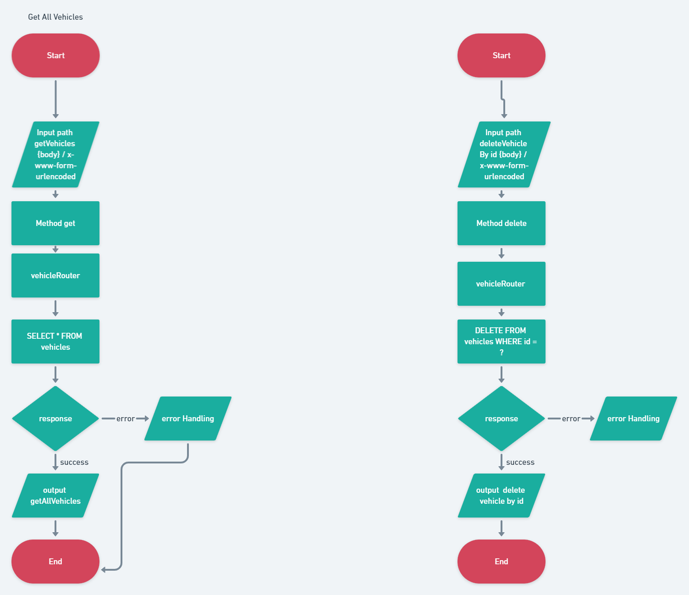
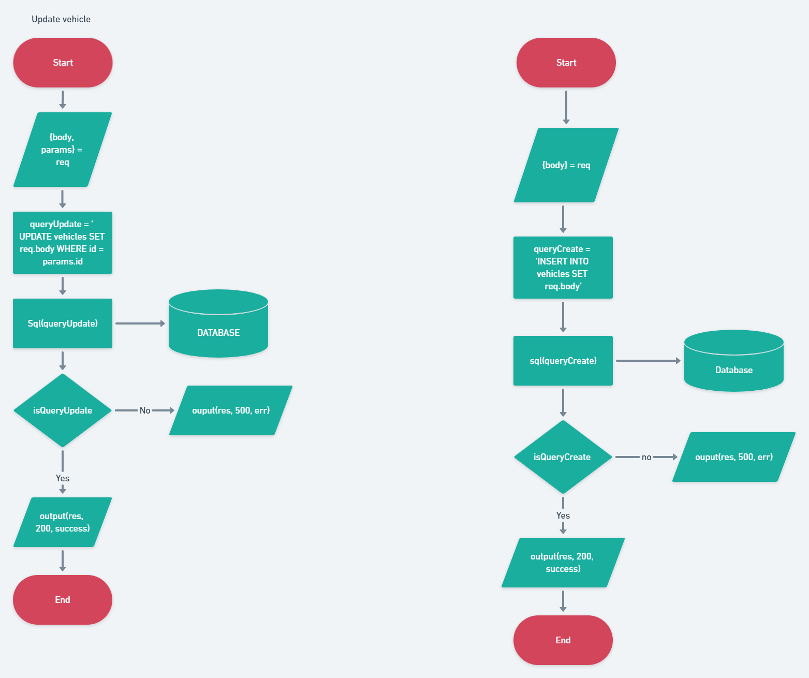

# BACKEND APP WITH ExpressJs AND MySQL

This non-optimized minimal backend app with mysql and nodeJs. Backend app theme is "Rental Vehicle".

## **Requirements**

- NodeJS v14.17.5 LTS
- MySQL
- ExpressJS

## **How To Run THis App**

- Make sure you had clone this repo
- Copy environment from `.env.example` to `.env`
- Configure your `.env` file according to your `MySQL` credentials
- Open your terminal in this project and run

  ```
  npm i
  ```

- And then

  ```
  npm start
  ```

## **Flowchart Get and Delete**



## **Flowchart update and insert**


